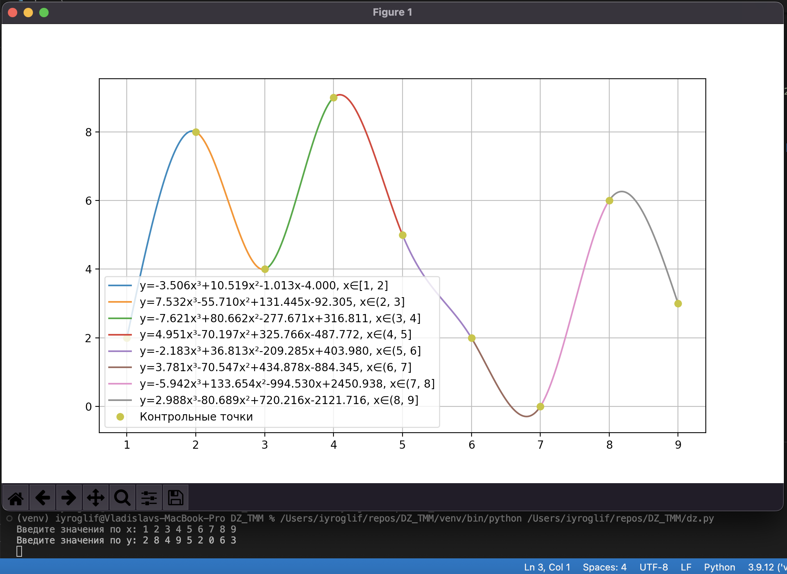
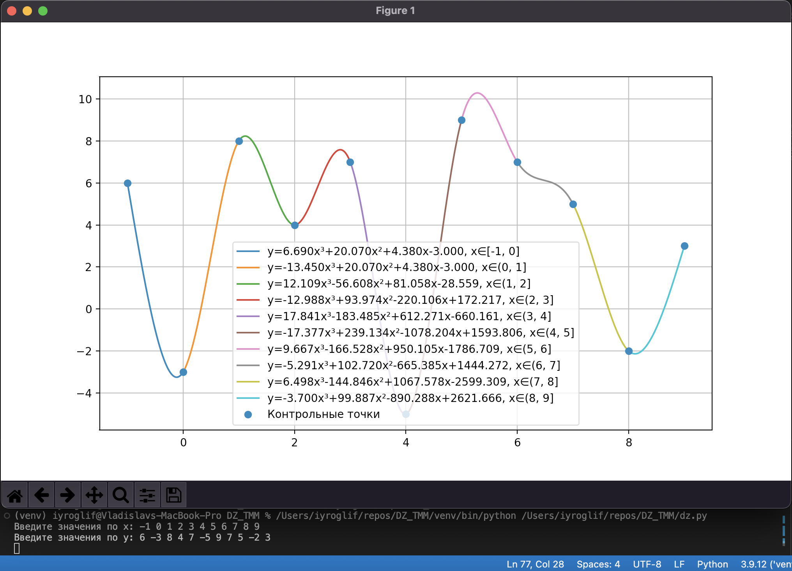

МГТУ им. Н.Э. Баумана Кафедра ИУ5

# Домашнее задание по дисциплине "Технологии мультимедиа"

> Терентьев В.О. Группа ИУ5-63Б

## Описание задания

Разработать на языке Python интерактивную программу вычисления и построения графика классического кубического сплайна на наборе из 10 контрольных точек c отображением уравнений сплайна

## Скрины

## Отчет

Файл: [pdf](/%D0%A2%D0%B5%D1%80%D0%B5%D0%BD%D1%82%D1%8C%D0%B5%D0%B2%20%D0%98%D0%A35-63%D0%91%20%D0%94%D0%97%20%D0%A2%D0%9C%D0%9C%20%D0%92%D0%B0%D1%80%D0%B8%D0%B0%D0%BD%D1%82%2059.pdf)
